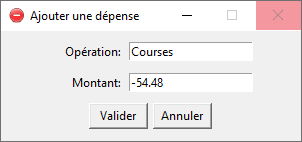
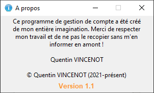

# Gestion de compte (V1.0)

Ce programme est un outil de gestion de compte, permettant de synthétiser des revenus/dépenses.  
Le programme a été développé en utilisant la librairie Tkinter.

  

  

